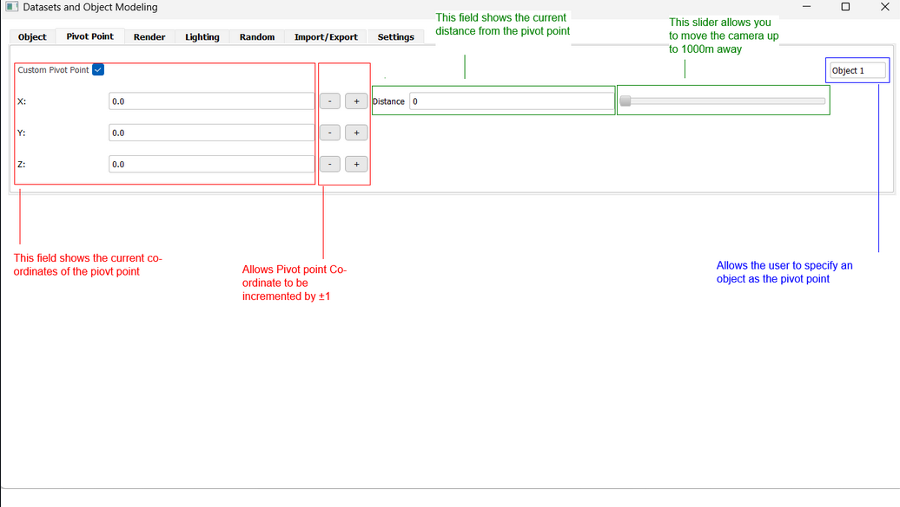

## Datasets and Object Manipulation (D.O.M)

Welcome to your new program! Here's a quick guide to get started along with some tips and tricks to help you make the most of it.

---

### Introduction

Generating images of 3D objects can be tedious when working with large datasets. D.O.M. is here to simplify the process. This program is designed to help you efficiently generate datasets for your 3D objects. It aims to make dataset generation easier, while offering a dedicated tool for your needs.

---

---

### Installation Prerequisites
##### General Prerequisites
1. Ensure you have python installed - https://www.python.org/downloads/ 
1. Set up your workspace and navigate to it in VSCode or your chosen code editor of choice.
1. In terminal <code style="color:Gray">run pip install -r requirements.txt</code>

##### MacOS Prerequisites
Error Message - (Permission Error: Operation not permitted)
1. Open system settings and navigate to privacy & security
1. Navigate to full disk access and add new applications. 
1. Give terminal full disk access: Applications/Utilities/terminal
1. Give vs-code full disk access: Applications/VSCode
1. Ensure that both of these applications are selected for this to avoid the permission error.

---

### Getting Started

To run D.O.M., simply execute the `UI.py` file located in the `frontend` folder.

#### Steps:
1. Begin by loading a tutorial object or uploading an object.
   
   
   
2. When uploading a custom object, you can choose to upload an individual file or a folder. (Uploaded items will share their file name within the software.)
   
   

3. Once an object is uploaded, the viewport will automatically update. Any changes you make to elements in the scene will trigger automatic updates in the viewport.
   
   

---

### Object Bar

When an object is uploaded, the **ObjectBar** will append an element. This allows you to specify whether particular objects in the scene should be grounded or not.

---

### Object Tab

The **ObjectTab** enables users to change the starting elements for each object. Users can select the object via the combobox (highlighted in orange below).

---

### Pivot Tab

The **PivotTab** allows users to:

- Specify a custom pivot point (red).
- Assign an object as the pivot point (blue).
- Set the distance between the camera and the pivot point in meters (green).

---

### Render Tab

The **RenderTab** provides options to configure rendering settings:

- Specify the number of renders to generate (red).
- Define the change in degrees per axis of freedom (green).
- Begin rendering by pressing **Generate Renders** (blue).
- Use the unlimited render feature to generate renders continuously until manually stopped (orange).

- Preview the current render configuration before generating final outputs (pink).

---

### Lighting Tab

The **LightingTab** lets users fine-tune lighting options:

- Adjust light strength (red).
- Change light color (green).
- Modify light radius (blue).
- Select the type of light (pink).
- Specify light position (orange).
- Set light angle (neon).

---

### Random Tab

The **RandomTab** allows fields across all pages to be set to random:

- Activate randomness globally (red).
- Set randomness per set (green) or per frame (blue).
- Adjust the random seed value (orange).

#### Random Selection:

- Activate specific fields using the checkbox (red).
- Define lower and upper bounds for random elements (green and blue).
- Change the target object (orange).
- Set all elements on the current page to active (pink).

---
### Citation and Terms of Use

1. Scope of License
As defined by https://creativecommons.org/share-your-work/cclicenses/

CC BY-NC-SA

This license enables reusers to distribute, remix, adapt, and build upon the material in any medium or format for noncommercial purposes only, and only so long as attribution is given to the creator. If you remix, adapt, or build upon the material, you must license the modified material under identical terms. CC BY-NC-SA.

2. Restrictions
- Users agree not to employ automated systems, algorithms, or processes—including but not limited to web crawlers, data scraping tools, or AI models—to extract or analyse any part of this software or its associated data.
- The software or its contents shall not be integrated into training datasets for machine learning or AI systems. The outputted data may be used in non-commercial AI training.
- Users agree not to attempt reverse engineering, decompiling, disassembling, or modifying any part of the software, unless the altered software is made available as open source

3. Attribution
Any research or publications resulting from the use of this software must include proper citation and acknowledgment as specified by the software provider.

 - Oliver Japp, Ilya Waywell, Dominic Brown, Ben Brown, Ethan Burke, Miller Dawson, and Sophie Bowie. Datasets and Object Manipulation (D.O.M). Version 1.0, April 15, 2025. [D.O.M. GitHub Page](https://github.com/b3nb07/Datasets_and_Object_Manipulation-D.O.M.).

4. Acceptance
By downloading, installing, or using the software, users acknowledge that they have read, understood, and agreed to these terms of use.
