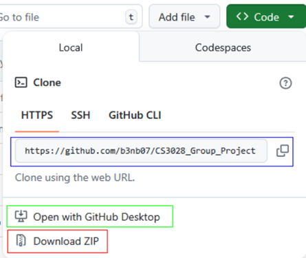

# CS3028 Group Project

## Datasets for Objects and Manipulation (D.O.M)

### Goals and scope

### Overview:
The project is to develop a program that can upload 3D object/s int a space allowing a specified
pivot point. Then rotating around the pivot point if the object at the angle at regular intervals.
Thus creating a dataset for “Predictive change”.  

### Scope:
● Software must be portable across all systems (dockerised)  
● 3D environment to place 3D objects  
● Must have tutorial objects  
● Must have base shapes (Cube, Sphere, Triangle)  
● Must allow n amount of objects (where n ∈ N+)  
● Must allow random object spawns and orientations  
    ○ All randomness must be seeded  
● Must allow custom pivot points for camera rotation  
● Allow 3D object transformation:  
    ○ To the X, Y, Z axis coordinates  
    ○ To the Length, Breadth, Height transformations  
    ○ To rotation  
● Allow camera to be manually rotated  
    ○ Allow automated custom rotations to create exportable datasets (degree of
rotation between images)  
● Import/export modifications to a json file  
    ○ Must be able to read all majour 3D file types  
    ○ Must integrate with blender  
● Must have a simplified menu and advanced options  
    ○ Allow custom environments / void  

### Boundaries:
● All files will be localised  
● No security concerns as everything is local  
● Desktop program - No website / App / Web Interface  
● Must be portable across all systems (MacOS, Windows)  
● Tutorials will cover basic functions / User Manual  
● Readme file includes instructions on how to use software  

### Installation

You can use 3 methods to install this project. 

Blue: using  
git clone https://github.com/b3nb07/CS3028_Group_Project.git  
Copy and paste this into your IDE's terminal  

Green:  
If you have github desktop you can click "Open with GitHub Desktop"  

Red:  
Download ZIP -> Extract ZIP -> Insert into workplace of IDE

### Requirements
To run this software the prerequisite installs are:  
    Python - https://www.python.org/  
    pyqt5 - https://pypi.org/project/PyQt5/  
    blenderproc - https://github.com/DLR-RM/BlenderProc  
    numpy - https://numpy.org/install/  

Commands: 

pip install pyqt5  
pip install blenderproc  
pip install numpy  

### Test System works: 

Frontend:  
On line 217 you need to uncomment this section to test all Fields except random tests

On line 1095 you need to uncomment this section to test all Random Fields  

Backend:
Navigate to backend/backend_testing.py and run the file

### Running the Program

To run the program navigate to frontend/UI.py and run  
or  
Navigate to termial and run 
PS C:[Path_To_Project] python -u "c:[Path_To_Project]\frontend\UI.py"

### Extension of the system and future additions  

Randomisation currently only works for generating random values at the start of generation meaning that that value is used throughout the set. Future development could include the randomisation of values between frames generated allowing for further randomisation control.
During the survey users often responded to the lack of visual feedback in regards to the viewport, often citing that a loading bar or feedback in some form would provide greater usability.
One of the features we didn't manage to implement was the portability of D.O.M over other operating systems. We attempted to achieve this through docker as requested by the client but as later discovered was not feasible due to the user interface We have included the code of where we finished with the dockerization for your convenience. We also tried to bundle all of the files and include all of the modules we used (like blenderproc etc) but then when you try and run the executable it just crashes because it can't find blender because blenderproc doesn't initialise or work properly when packaged.
If you intend to implement more features in the backend that would require more pages within the navigation section or a rehaul of the user interface we suggest implementing in a more object oriented manner. We have included a base template, this new structure should be similar in design to the random pages. Please note that this task would require re-connecting all backend and frontend.

    
################################  
class Pages(QWidget):
    def __init__(self, parent: QWidget, ParentTab: QTabWidget):
        super().__init__(parent)

        """Intended to be accessed via self.Fields.Keys()"""
        self.Fields = {}
        self.Sliders = {}
        self.MinusButtons = {}
        self.AdditionButtons = {}

        main_layout = QGridLayout()

    def function(self):
        pass
############################
